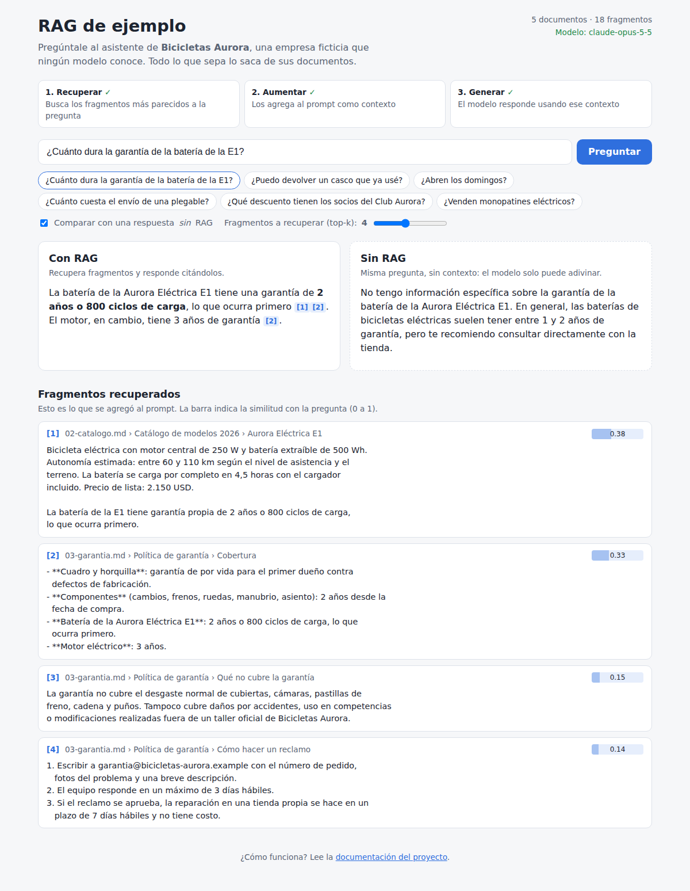
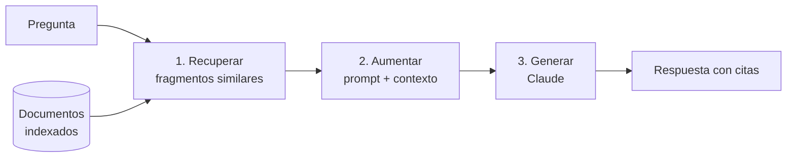

# RAG de ejemplo · React + TypeScript + Node

Una aplicación pequeña y completa de **RAG** (*Retrieval-Augmented Generation*) con
**documentación en español** para aprender y enseñar qué es, cómo funciona y por qué
conviene usarlo.

### 👉 [Probar la demo en vivo](https://reeb-dev.github.io/rag-ejemplo/) · [Leer la guía en la web](https://reeb-dev.github.io/rag-ejemplo/#/guia)

La demo en GitHub Pages funciona sin instalar nada: la búsqueda corre en tu navegador. Para
que además redacte respuestas, pega tu propia clave de API de Anthropic (se guarda solo en
tu navegador).



<sub>Captura ilustrativa: las respuestas exactas del modelo varían.</sub>

## ¿Qué es RAG, en 30 segundos?

Un modelo de lenguaje no conoce tus documentos privados y, cuando no sabe algo, puede
inventarlo. RAG lo resuelve en tres pasos:

1. **Recuperar:** buscar en tus documentos los fragmentos relevantes para la pregunta.
2. **Aumentar:** pegarlos en el prompt como contexto.
3. **Generar:** el modelo responde usando ese contexto y citando las fuentes.



**Ventajas principales:** usa datos propios sin reentrenar el modelo, reduce las
alucinaciones, se actualiza con solo cambiar los documentos, cita sus fuentes, es barato
por consulta y permite controlar qué ve cada usuario.
Detalle completo en [Beneficios y ventajas](docs/03-beneficios-y-ventajas.md).

## La demo

El asistente responde preguntas sobre **Bicicletas Aurora**, una empresa **inventada**
cuyos documentos están en [`data/`](data). Como ningún modelo puede conocerla, cada
respuesta correcta demuestra que la información vino de la recuperación.

La interfaz muestra:

- los **tres pasos** de RAG mientras se procesa la pregunta;
- la **respuesta en streaming** con citas `[1]`, `[2]` enlazadas a su fuente;
- los **fragmentos recuperados** con su puntuación de similitud;
- un modo **"comparar sin RAG"** para ver lado a lado cómo responde el modelo sin contexto;
- un control **top-k** para cambiar cuántos fragmentos se recuperan.

## Cómo ejecutarlo en tu computadora

Requisitos: **Node.js 20 o superior**.

```bash
git clone https://github.com/reeb-dev/rag-ejemplo.git
cd rag-ejemplo
npm install
cp .env.example .env      # y pega tu clave en ANTHROPIC_API_KEY
npm run dev
```

Abre <http://localhost:5173>.

- La clave se obtiene en <https://console.anthropic.com/>.
- **Sin clave también funciona**, en *modo solo recuperación*: verás qué fragmentos se
  enviarían al modelo, que es la parte más interesante para entender RAG.

Otros comandos:

| Comando | Qué hace |
| --- | --- |
| `npm run dev` | Backend (puerto 3001) y frontend (puerto 5173) con recarga automática. |
| `npm test` | Tests del pipeline (fragmentado, búsqueda, prompt). |
| `npm run build && npm start` | Compila todo y sirve la app completa en <http://localhost:3001>. |
| `npm run query -w server -- "¿Abren los domingos?"` | Prueba el RAG desde la terminal. |
| `npm run build:pages` | Compila la versión estática (sin backend) que se publica en GitHub Pages. |

## Dos formas de ejecutar el mismo RAG

| | Con servidor (`npm run dev`) | Estática (GitHub Pages) |
| --- | --- | --- |
| Dónde se busca | En el backend de Node | En el navegador |
| Clave de API | En el servidor (`.env`), nadie la ve | La que pega cada visitante, guardada en su navegador |
| Documentos | Se leen de `data/` al arrancar | Se empaquetan en la web al compilar |
| Para qué sirve | Así se hace en producción | Demo pública y gratis, sin servidor |

El código de RAG es el mismo en los dos casos: vive en [`core/`](core/src) y lo usan
tanto el servidor como la web. En producción la clave debe quedarse siempre en un servidor;
el modo estático es solo para demos donde cada persona usa su propia clave.

Cada `push` a `main` vuelve a publicar la web con
[`.github/workflows/pages.yml`](.github/workflows/pages.yml).

## Estructura

```
core/      El RAG en sí (TypeScript sin dependencias de Node): lo usan el servidor y la web.
data/      Base de conocimiento de ejemplo (Markdown). Cámbiala por tus documentos.
docs/      Documentación sobre RAG, en español.
server/    Backend Node + Express + TypeScript: API, lectura de archivos y CLI.
web/       Frontend React + Vite + TypeScript.
```

El corazón está en [`core/src/`](core/src), un archivo por paso:
`documents` → `chunker` → `embeddings` → `vectorStore` → `prompt` → `generator`, unidos en
[`pipeline.ts`](core/src/pipeline.ts). Cada archivo está comentado en español.

> **Nota didáctica:** para que funcione sin servicios externos, la búsqueda usa **TF-IDF**
> en memoria en lugar de un modelo de embeddings y una base vectorial. El concepto es el
> mismo; en [Arquitectura del ejemplo](docs/04-arquitectura-del-ejemplo.md) se explica cómo
> pasar a embeddings reales y a pgvector.

## Documentación

La guía completa también se puede leer en la web, con la demo al lado.


| # | Capítulo |
| --- | --- |
| 1 | [¿Qué es RAG?](docs/01-que-es-rag.md) |
| 2 | [Cómo funciona paso a paso](docs/02-como-funciona.md) |
| 3 | [Beneficios y ventajas](docs/03-beneficios-y-ventajas.md) |
| 4 | [Arquitectura del ejemplo](docs/04-arquitectura-del-ejemplo.md) |
| 5 | [Buenas prácticas y limitaciones](docs/05-buenas-practicas-y-limitaciones.md) |
| 6 | [Guía práctica: arma tu propio RAG](docs/06-guia-practica.md) |
| 7 | [Sácale el jugo a RAG](docs/07-sacarle-el-jugo.md) |
| 8 | [Ejercicios para aprender o enseñar](docs/08-ejercicios.md) |
| 9 | [Glosario y recursos](docs/09-glosario-y-recursos.md) |

## Licencia

[MIT](LICENSE)
