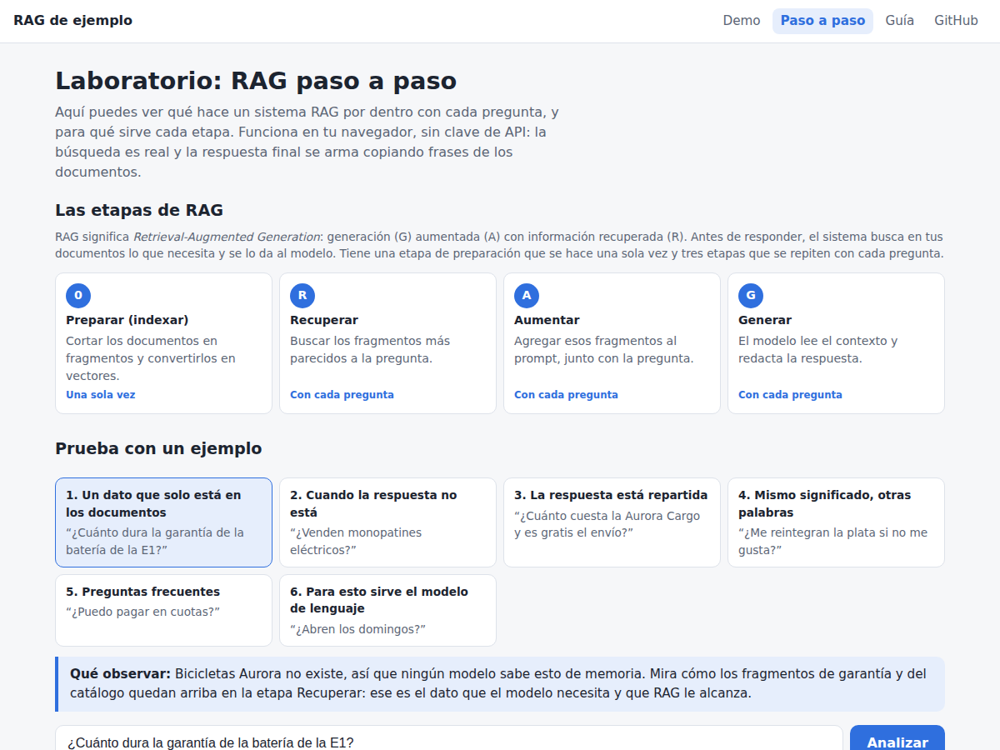
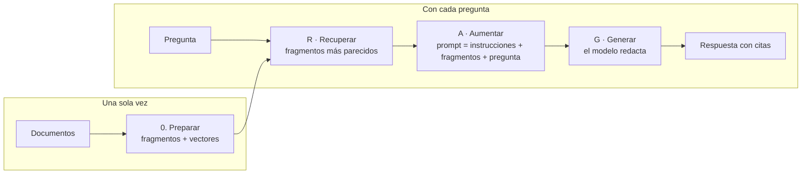

# RAG de ejemplo · React + TypeScript + Node

Una aplicación pequeña y completa de **RAG** (*Retrieval-Augmented Generation*) con
**documentación en español** para aprender y enseñar qué es, cómo funciona y por qué
conviene usarlo.

### 👉 [Abrir la web](https://reeb-dev.github.io/rag-ejemplo/) · [Paso a paso, sin clave de API](https://reeb-dev.github.io/rag-ejemplo/#/laboratorio) · [Guía](https://reeb-dev.github.io/rag-ejemplo/#/guia)



## ¿Qué es RAG?

**RAG** (*Retrieval-Augmented Generation*, "generación aumentada por recuperación") es
una técnica para que un modelo de lenguaje como Claude o ChatGPT responda usando
información que **no estaba en su entrenamiento**: los documentos de una empresa, los
apuntes de un curso, manuales o políticas internas.

Un modelo sabe muchísimo, pero no conoce tus documentos, no sabe lo que pasó después de
su entrenamiento y, cuando no sabe algo, a veces lo inventa. RAG lo resuelve así:

> Antes de preguntarle al modelo, **busca** en tus documentos los fragmentos que tienen
> que ver con la pregunta y **dáselos** junto con ella, para que responda en base a eso.

Es como pasar de un examen a libro cerrado a uno a libro abierto, con un bibliotecario
que te alcanza justo las páginas que necesitas.

## Las etapas de RAG



### 0. Preparar (indexar) · una sola vez

- **Qué hace:** corta los documentos en fragmentos chicos, de un solo tema, y convierte
  cada uno en un **vector**, una lista de números que representa de qué habla.
- **Por qué importa:** buscar en fragmentos permite encontrar el párrafo exacto, y como se
  hace una sola vez, cada pregunta después es rápida y barata.
- **En este ejemplo:** 5 documentos se convierten en 18 fragmentos, uno por sección
  ([`chunker.ts`](core/src/chunker.ts), [`embeddings.ts`](core/src/embeddings.ts)).

### R · Recuperar · con cada pregunta

- **Qué hace:** convierte la pregunta en un vector con el mismo método y busca los *k*
  fragmentos más parecidos (**top-k**).
- **Por qué importa:** es la etapa clave. Si el fragmento con la respuesta no aparece aquí,
  ningún modelo puede responder bien.
- **En este ejemplo:** similitud coseno sobre vectores TF-IDF
  ([`vectorStore.ts`](core/src/vectorStore.ts)). En un RAG real se usan embeddings que
  capturan el significado y una base de datos vectorial.

### A · Aumentar · con cada pregunta

- **Qué hace:** arma el texto que recibe el modelo con tres partes: **instrucciones**
  ("responde solo con el contexto, cita las fuentes, si no está di que no lo sabes"), los
  **fragmentos** recuperados y numerados, y la **pregunta**.
- **Por qué importa:** el modelo solo sabe lo que está en ese texto. Las instrucciones
  evitan que invente y la numeración permite citar de dónde sale cada dato.
- **En este ejemplo:** [`prompt.ts`](core/src/prompt.ts).

### G · Generar · con cada pregunta

- **Qué hace:** el modelo lee los fragmentos, entiende la pregunta y redacta la respuesta
  citando las fuentes `[1]`, `[2]`.
- **Por qué importa:** la búsqueda encuentra la información pero no la entiende. El modelo
  combina datos de varios fragmentos, descarta lo que no aplica y responde lo que se
  preguntó.
- **En este ejemplo:** Claude con *streaming* ([`generator.ts`](core/src/generator.ts)).
  Sin clave de API, una respuesta *extractiva* que copia las frases más relevantes
  ([`extractive.ts`](core/src/extractive.ts)).

Explicación completa en [Cómo funciona paso a paso](docs/02-como-funciona.md).

## Beneficios

1. **Usa tus propios datos** sin reentrenar el modelo.
2. **Inventa mucho menos:** tiene el dato delante y puede decir "no lo sé".
3. **Siempre actualizado:** alcanza con cambiar los documentos.
4. **Respuestas verificables:** cada dato indica de qué fragmento salió.
5. **Más barato:** solo envía al modelo lo relevante, no todos los documentos.
6. **Control de acceso:** puedes filtrar qué documentos ve cada usuario.
7. **Independiente del modelo:** el conocimiento vive en tus documentos.
8. **Fácil de empezar** y de mejorar por partes.

Detalle, comparación con fine-tuning y casos de uso en
[Beneficios y ventajas](docs/03-beneficios-y-ventajas.md).

## Cómo usar la web

La web tiene tres secciones y funciona sin instalar nada. Todo el ejemplo gira en torno a
**Bicicletas Aurora**, una empresa **inventada** cuyos documentos están en
[`data/`](data): como ningún modelo puede conocerla, cada respuesta correcta demuestra que
la información vino de la recuperación.

### Paso a paso (sin clave de API)

[Abrir el laboratorio](https://reeb-dev.github.io/rag-ejemplo/#/laboratorio). Es el mejor
punto de partida para entender RAG.

1. Lee el resumen de **las etapas de RAG** al principio.
2. Elige uno de los **seis ejemplos guiados** y lee el recuadro **"Qué observar"**.
3. Recorre las etapas: cada una explica qué hace, por qué importa y cómo se hace en un RAG
   real, y debajo muestra lo que pasó con tu pregunta: los fragmentos preparados, los
   términos de la pregunta, el puntaje de **todos** los fragmentos, las tres partes del
   prompt y la respuesta.
4. Mueve el **top-k** o escribe tu propia pregunta y mira qué cambia.

| Ejemplo | Qué enseña |
| --- | --- |
| Un dato que solo está en los documentos | RAG le da al modelo información que no podría saber. |
| Cuando la respuesta no está | Un buen RAG dice "no lo sé" en lugar de inventar. |
| La respuesta está repartida | Por qué importa elegir bien el top-k. |
| Mismo significado, otras palabras | Por qué un RAG real usa embeddings y no solo palabras. |
| Preguntas frecuentes | Documentos bien escritos hacen fácil la búsqueda. |
| Para esto sirve el modelo de lenguaje | La búsqueda encuentra; el modelo entiende y redacta. |

### Demo

[Abrir la demo](https://reeb-dev.github.io/rag-ejemplo/). Un asistente de atención al
cliente con RAG.

1. Haz clic en una pregunta de ejemplo o escribe la tuya.
2. Mira cómo se marcan las etapas **Recuperar → Aumentar → Generar** y los **fragmentos
   recuperados** debajo, con su puntaje.
3. Activa **"Comparar con una respuesta sin RAG"** para ver lado a lado la diferencia.
4. Sin clave, la respuesta se arma copiando frases de los fragmentos. Para que la redacte
   Claude, crea una clave en [console.anthropic.com](https://console.anthropic.com/)
   (sección *API Keys*) y pégala en el recuadro de arriba. Se guarda solo en tu navegador
   y el uso se cobra a tu cuenta.

### Guía

[Abrir la guía](https://reeb-dev.github.io/rag-ejemplo/#/guia). Los 9 capítulos de
[`docs/`](docs): desde qué es RAG hasta cómo armar el tuyo, cómo sacarle el jugo y
ejercicios para aprender o enseñar.

## Cómo ejecutarlo en tu computadora

Requisitos: **Node.js 20 o superior**.

```bash
git clone https://github.com/reeb-dev/rag-ejemplo.git
cd rag-ejemplo
npm install
cp .env.example .env      # y pega tu clave en ANTHROPIC_API_KEY
npm run dev
```

Abre <http://localhost:5173>.

- La clave se obtiene en <https://console.anthropic.com/>.
- **Sin clave también funciona**, sin IA: busca los fragmentos y arma la respuesta
  copiando las frases más relevantes. La pestaña *Paso a paso* muestra todo el proceso.

Otros comandos:

| Comando | Qué hace |
| --- | --- |
| `npm run dev` | Backend (puerto 3001) y frontend (puerto 5173) con recarga automática. |
| `npm test` | Tests del pipeline (fragmentado, búsqueda, prompt). |
| `npm run build && npm start` | Compila todo y sirve la app completa en <http://localhost:3001>. |
| `npm run query -w server -- "¿Abren los domingos?"` | Prueba el RAG desde la terminal. |
| `npm run build:pages` | Compila la versión estática (sin backend) que se publica en GitHub Pages. |

## Dos formas de ejecutar el mismo RAG

| | Con servidor (`npm run dev`) | Estática (GitHub Pages) |
| --- | --- | --- |
| Dónde se busca | En el backend de Node | En el navegador |
| Clave de API | En el servidor (`.env`), nadie la ve | La que pega cada visitante, guardada en su navegador |
| Documentos | Se leen de `data/` al arrancar | Se empaquetan en la web al compilar |
| Para qué sirve | Así se hace en producción | Demo pública y gratis, sin servidor |

El código de RAG es el mismo en los dos casos: vive en [`core/`](core/src) y lo usan
tanto el servidor como la web. En producción la clave debe quedarse siempre en un servidor;
el modo estático es solo para demos donde cada persona usa su propia clave.

Cada `push` a `main` vuelve a publicar la web con
[`.github/workflows/pages.yml`](.github/workflows/pages.yml).

## Estructura

```
core/      El RAG en sí (TypeScript sin dependencias de Node): lo usan el servidor y la web.
data/      Base de conocimiento de ejemplo (Markdown). Cámbiala por tus documentos.
docs/      Documentación sobre RAG, en español.
server/    Backend Node + Express + TypeScript: API, lectura de archivos y CLI.
web/       Frontend React + Vite + TypeScript.
```

El corazón está en [`core/src/`](core/src), un archivo por paso:
`documents` → `chunker` → `embeddings` → `vectorStore` → `prompt` → `generator`, unidos en
[`pipeline.ts`](core/src/pipeline.ts). Cada archivo está comentado en español.

> **Nota didáctica:** para que funcione sin servicios externos, la búsqueda usa **TF-IDF**
> en memoria en lugar de un modelo de embeddings y una base vectorial. El concepto es el
> mismo; en [Arquitectura del ejemplo](docs/04-arquitectura-del-ejemplo.md) se explica cómo
> pasar a embeddings reales y a pgvector.

## Documentación

La guía completa también se puede leer en la web, con la demo al lado.


| # | Capítulo |
| --- | --- |
| 1 | [¿Qué es RAG?](docs/01-que-es-rag.md) |
| 2 | [Cómo funciona paso a paso](docs/02-como-funciona.md) |
| 3 | [Beneficios y ventajas](docs/03-beneficios-y-ventajas.md) |
| 4 | [Arquitectura del ejemplo](docs/04-arquitectura-del-ejemplo.md) |
| 5 | [Buenas prácticas y limitaciones](docs/05-buenas-practicas-y-limitaciones.md) |
| 6 | [Guía práctica: arma tu propio RAG](docs/06-guia-practica.md) |
| 7 | [Sácale el jugo a RAG](docs/07-sacarle-el-jugo.md) |
| 8 | [Ejercicios para aprender o enseñar](docs/08-ejercicios.md) |
| 9 | [Glosario y recursos](docs/09-glosario-y-recursos.md) |

## Licencia

[MIT](LICENSE)
