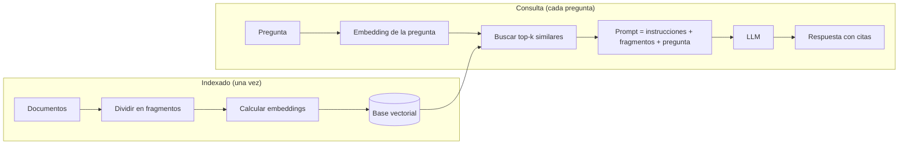

# 2. Cómo funciona RAG, paso a paso

> 🔬 Mientras lees, abre el [laboratorio paso a paso](https://reeb-dev.github.io/rag-ejemplo/#/laboratorio):
> muestra cada una de estas etapas con una pregunta real, sin clave de API.

Un sistema RAG tiene **dos fases**:

1. **Indexado** (se hace una vez, o cada vez que cambian los documentos).
2. **Consulta** (se hace en cada pregunta).



## Fase 1: indexado

### 1.1 Cargar los documentos

Se leen las fuentes: archivos Markdown, PDFs, páginas web, filas de una base de datos,
tickets de soporte... En este ejemplo son los `.md` de la carpeta [`data/`](../data).

> Código: [`core/src/documents.ts`](../core/src/documents.ts) y [`server/src/rag/loader.ts`](../server/src/rag/loader.ts)

### 1.2 Dividir en fragmentos (*chunking*)

Los documentos se cortan en trozos más pequeños, de unos cientos de palabras. ¿Por qué?

- **Precisión:** si indexas un manual entero como un solo bloque, cualquier pregunta
  "se parece un poco" a él. Fragmentos chicos permiten encontrar *el párrafo* exacto.
- **Costo:** al modelo solo le mandas lo relevante, no el manual completo.
- **Límite de contexto:** aunque los modelos actuales aceptan contextos enormes, cuanto
  más texto irrelevante hay, más fácil es que el dato clave se diluya.

Estrategias habituales:

| Estrategia | Cómo funciona | Cuándo usarla |
| --- | --- | --- |
| Tamaño fijo | Cortar cada N caracteres o tokens | Texto sin estructura |
| Por estructura | Cortar por títulos, secciones o párrafos | Markdown, HTML, documentación |
| Con solapamiento | Repetir unas líneas entre fragmentos | Para no partir una idea a la mitad |
| Semántica | Cortar donde cambia el tema (usando embeddings) | Textos largos y heterogéneos |

Este ejemplo corta **por títulos de Markdown** y, si una sección es muy larga, por
párrafos con un pequeño **solapamiento**. Cada fragmento guarda la ruta de títulos
(`Política de garantía › Cobertura`), lo que ayuda mucho a la búsqueda.

> Código: [`core/src/chunker.ts`](../core/src/chunker.ts)

### 1.3 Calcular *embeddings*

Un **embedding** es un vector (una lista de números) que representa el significado de un
texto. Textos con significado parecido producen vectores cercanos.

```
"¿Puedo devolver la bici?"        → [0.12, -0.40, 0.88, ...]
"Política de devoluciones"        → [0.10, -0.35, 0.91, ...]   ← cerca
"Horario de atención los sábados" → [-0.70, 0.22, 0.05, ...]   ← lejos
```

En producción se usa un **modelo de embeddings** (por ejemplo Voyage AI, que es el que
recomienda Anthropic, u opciones de código abierto como `bge-m3`). Este ejemplo usa
**TF-IDF**, una técnica clásica que se calcula localmente sin claves ni descargas: cada
dimensión del vector es una palabra, con más peso cuanto más rara es en el corpus. Es
menos "inteligente" (no sabe que *devolver* y *reembolso* son sinónimos) pero se entiende
en 100 líneas de código. Ver [cómo cambiarlo por embeddings reales](04-arquitectura-del-ejemplo.md#cambiar-a-embeddings-reales).

> Código: [`core/src/embeddings.ts`](../core/src/embeddings.ts)

### 1.4 Guardar en una base vectorial

Los vectores se guardan junto al texto del fragmento. Las bases de datos vectoriales
(pgvector, Qdrant, Chroma, Pinecone, Weaviate...) están optimizadas para responder rápido
"¿cuáles son los vectores más cercanos a este?" entre millones de entradas. Para un ejemplo
con decenas de fragmentos alcanza con un array en memoria.

> Código: [`core/src/vectorStore.ts`](../core/src/vectorStore.ts)

## Fase 2: consulta

### 2.1 Recuperar (R)

La pregunta del usuario se convierte en vector con **el mismo** método de embeddings, y se
buscan los `k` fragmentos más parecidos. La medida más común es la **similitud coseno**:
1 = mismo significado, 0 = nada en común.

El parámetro **top-k** (cuántos fragmentos traer) es un equilibrio:

- **k muy bajo:** puede faltar información (la respuesta estaba en el fragmento 4).
- **k muy alto:** más costo y más "ruido" que puede confundir al modelo.

En la app puedes mover el control *top-k* y ver cómo cambian los fragmentos.

### 2.2 Aumentar (A)

Se arma el prompt. Un buen prompt de RAG tiene:

1. **Instrucciones de sistema:** quién es el asistente, que responda solo con el contexto,
   que diga "no lo sé" si no está, y que cite las fuentes.
2. **El contexto:** los fragmentos, numerados y delimitados (aquí con etiquetas XML como
   `<fragmento numero="1">`, que Claude interpreta muy bien).
3. **La pregunta.**

```text
<contexto>
<fragmento numero="1" documento="03-garantia.md" seccion="Política de garantía › Cobertura">
- **Batería de la Aurora Eléctrica E1**: 2 años o 800 ciclos de carga...
</fragmento>
...
</contexto>

Pregunta: ¿Cuánto dura la garantía de la batería de la E1?
```

> Código: [`core/src/prompt.ts`](../core/src/prompt.ts)

### 2.3 Generar (G)

El LLM lee el contexto y redacta la respuesta. Como tiene el texto delante, no necesita
"recordar": solo leer, seleccionar y redactar, que es justo lo que mejor hace. El ejemplo
usa Claude con *streaming* para que la respuesta aparezca palabra a palabra.

> Código: [`core/src/generator.ts`](../core/src/generator.ts)

## Todo junto

La clase `RagPipeline` une las piezas y es el mejor punto de partida para leer el código:

> Código: [`core/src/pipeline.ts`](../core/src/pipeline.ts)

---

← [1. Qué es RAG](01-que-es-rag.md) · Siguiente: [3. Beneficios y ventajas →](03-beneficios-y-ventajas.md)
