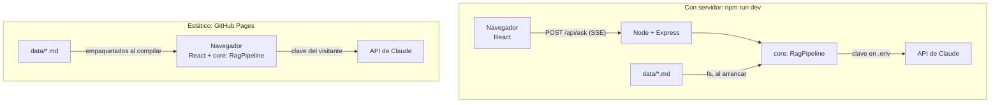

# 4. Arquitectura del ejemplo

## Vista general

El mismo código de RAG (`core/`) se puede ejecutar en dos lugares:



La web decide sola: si encuentra el backend (`/api/health`), lo usa; si no (en GitHub
Pages), carga el RAG en el navegador. Ver [`web/src/engine.ts`](../web/src/engine.ts).

```
rag-ejemplo/
├── core/                  ← el RAG, sin dependencias de Node (servidor y navegador)
│   ├── src/
│   │   ├── documents.ts   ← 1. archivo → documento
│   │   ├── chunker.ts     ← 2. dividir en fragmentos
│   │   ├── embeddings.ts  ← 3. texto → vectores (TF-IDF)
│   │   ├── vectorStore.ts ← 4. guardar y buscar vectores
│   │   ├── prompt.ts      ← A: armar el prompt con contexto
│   │   ├── generator.ts   ← G: llamar a Claude en streaming
│   │   ├── pipeline.ts    ← une todo
│   │   └── types.ts
│   └── test/rag.test.ts   ← tests con Vitest
├── data/                  ← la base de conocimiento (Markdown)
├── docs/                  ← esta documentación
├── server/                ← backend Node + Express + TypeScript
│   └── src/
│       ├── index.ts       ← servidor Express y endpoints
│       ├── cli.ts         ← probar el RAG desde la terminal
│       ├── config.ts
│       └── rag/loader.ts  ← leer data/ del disco
├── web/                   ← frontend React + Vite + TypeScript
│   └── src/
│       ├── App.tsx
│       ├── engine.ts      ← RAG en el servidor o en el navegador
│       └── components/    ← pasos, respuesta, fragmentos
└── .github/workflows/
    ├── ci.yml             ← tests y build en cada push
    └── pages.yml          ← publica la web en GitHub Pages
```

## Endpoints del backend

| Método | Ruta | Qué hace |
| --- | --- | --- |
| `GET` | `/api/health` | Documentos indexados, cantidad de fragmentos y modelo en uso. |
| `GET` | `/api/chunks` | Todos los fragmentos, para ver cómo se dividieron los documentos. |
| `POST` | `/api/search` | Solo recuperación: `{ "question": "...", "topK": 4 }` → fragmentos con su puntuación. |
| `POST` | `/api/ask` | RAG completo en streaming. Body: `{ "question": "...", "mode": "rag" \| "sin-rag", "topK": 4 }`. |

`/api/ask` responde con **Server-Sent Events**:

```text
event: sources
data: [{"docId":"03-garantia.md","section":"...","text":"...","score":0.38}, ...]

event: delta
data: "La batería de la E1 tiene "

event: delta
data: "garantía de 2 años o 800 ciclos [1]."

event: done
data: {}
```

Primero llegan los fragmentos (para mostrarlos de inmediato) y luego el texto de la
respuesta a medida que Claude lo genera.

## El generador (Claude)

[`generator.ts`](../core/src/generator.ts) usa el SDK oficial `@anthropic-ai/sdk`:

- **Modelo:** `claude-opus-5-5` por defecto; se cambia con `CLAUDE_MODEL` en `.env`.
- **Streaming:** `client.beta.messages.stream(...)` y se reenvía cada `text_delta`.
- **Esfuerzo bajo** (`output_config.effort: "low"`): para preguntas y respuestas cortas
  da respuestas rápidas y económicas.
- **Respaldo del servidor** (`fallbacks: "default"`): si el modelo declina una petición,
  la API la reintenta con otro modelo automáticamente.

Sin clave, la app responde **sin IA**, con una respuesta *extractiva*
([`extractive.ts`](../core/src/extractive.ts)): elige las frases de los fragmentos
recuperados que más términos comparten con la pregunta y las copia con su cita. Si
ninguna frase cubre la pregunta, responde que no encontró la información. Así se puede
estudiar RAG completo sin ninguna cuenta, y comparar con lo que agrega un LLM.

## El laboratorio paso a paso

La pestaña **Paso a paso** de la web ([`web/src/Lab.tsx`](../web/src/Lab.tsx)) muestra
por dentro cada etapa para una pregunta, sin clave de API: los términos en que se
convierte la pregunta y su peso, el puntaje de **todos** los fragmentos con el corte de
top-k, el prompt exacto que recibiría el modelo y la respuesta extractiva. Incluye seis
ejemplos guiados, cada uno con lo que conviene observar.

### La clave de API en la versión estática

En GitHub Pages no hay servidor, así que el navegador llama directamente a la API de
Claude (`dangerouslyAllowBrowser: true` en el SDK) con la clave que pega cada visitante,
guardada en su `localStorage`. Esto está bien para una demo donde **cada persona usa su
propia clave**, pero nunca para una app pública con **tu** clave: cualquiera podría leerla
desde el navegador. En producción, la llamada a Claude va siempre en un servidor, como en
el modo `npm run dev`.

## GitHub Pages

[`.github/workflows/pages.yml`](../.github/workflows/pages.yml) se ejecuta en cada push a
`main`: corre los tests, compila la web con `npm run build:pages` (que activa el modo
estático y ajusta la ruta base a `/<nombre-del-repo>/`) y la publica. Para usarlo en tu
propio fork: *Settings → Pages → Source: GitHub Actions*.

## Cambiar a embeddings reales

TF-IDF compara **palabras**; un modelo de embeddings compara **significados**. Para pasar
a embeddings reales, implementa la interfaz `Embedder`. Como los vectores densos no tienen
"vocabulario", lo más simple es guardar el vector como `Map` de índice → valor, o adaptar
`InMemoryVectorStore` para usar arrays. Esquema con Voyage AI (el proveedor de embeddings
que recomienda Anthropic):

```ts
// Esquema orientativo: consulta la documentación de Voyage AI para la API exacta.
class VoyageEmbedder {
  async embedMany(texts: string[], inputType: "document" | "query"): Promise<number[][]> {
    const res = await fetch("https://api.voyageai.com/v1/embeddings", {
      method: "POST",
      headers: {
        Authorization: `Bearer ${process.env.VOYAGE_API_KEY}`,
        "Content-Type": "application/json",
      },
      body: JSON.stringify({ input: texts, model: "voyage-3.5", input_type: inputType }),
    });
    const json = await res.json();
    return json.data.map((d: { embedding: number[] }) => d.embedding);
  }
}
```

Cambios necesarios:

1. Las llamadas pasan a ser **asíncronas** (`await`), así que `index()` y `search()` también.
2. Al indexar, se calculan los embeddings de todos los fragmentos **una vez** y conviene
   guardarlos en disco o en una base vectorial para no recalcularlos en cada arranque.
3. La similitud coseno se calcula con arrays (`Σ aᵢ·bᵢ` si están normalizados).

## Pasar a una base vectorial

Para miles o millones de fragmentos, reemplaza `InMemoryVectorStore` por una base
vectorial. Con **PostgreSQL + pgvector**, por ejemplo:

```sql
CREATE EXTENSION vector;
CREATE TABLE chunks (
  id text PRIMARY KEY,
  doc_id text,
  section text,
  content text,
  embedding vector(1024)
);
-- Los 4 más parecidos a la pregunta (<=> es distancia coseno):
SELECT id, content, 1 - (embedding <=> $1) AS score
FROM chunks ORDER BY embedding <=> $1 LIMIT 4;
```

---

← [3. Beneficios y ventajas](03-beneficios-y-ventajas.md) · Siguiente: [5. Buenas prácticas y limitaciones →](05-buenas-practicas-y-limitaciones.md)
