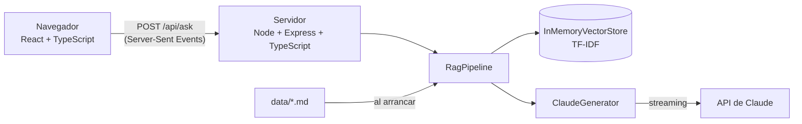

# 4. Arquitectura del ejemplo

## Vista general



```
rag-ejemplo/
├── data/                  ← la base de conocimiento (Markdown)
├── docs/                  ← esta documentación
├── server/                ← backend Node + TypeScript
│   ├── src/
│   │   ├── index.ts       ← servidor Express y endpoints
│   │   ├── cli.ts         ← probar el RAG desde la terminal
│   │   ├── config.ts
│   │   └── rag/
│   │       ├── loader.ts      ← 1. cargar documentos
│   │       ├── chunker.ts     ← 2. dividir en fragmentos
│   │       ├── embeddings.ts  ← 3. texto → vectores (TF-IDF)
│   │       ├── vectorStore.ts ← 4. guardar y buscar vectores
│   │       ├── prompt.ts      ← A: armar el prompt con contexto
│   │       ├── generator.ts   ← G: llamar a Claude en streaming
│   │       ├── pipeline.ts    ← une todo
│   │       └── types.ts
│   └── test/rag.test.ts   ← tests con Vitest
└── web/                   ← frontend React + Vite + TypeScript
    └── src/
        ├── App.tsx
        ├── api.ts             ← cliente de /api/ask (lee el streaming)
        └── components/        ← pasos, respuesta, fragmentos
```

## Endpoints del backend

| Método | Ruta | Qué hace |
| --- | --- | --- |
| `GET` | `/api/health` | Documentos indexados, cantidad de fragmentos y modelo en uso. |
| `GET` | `/api/chunks` | Todos los fragmentos, para ver cómo se dividieron los documentos. |
| `POST` | `/api/search` | Solo recuperación: `{ "question": "...", "topK": 4 }` → fragmentos con su puntuación. |
| `POST` | `/api/ask` | RAG completo en streaming. Body: `{ "question": "...", "mode": "rag" \| "sin-rag", "topK": 4 }`. |

`/api/ask` responde con **Server-Sent Events**:

```text
event: sources
data: [{"docId":"03-garantia.md","section":"...","text":"...","score":0.38}, ...]

event: delta
data: "La batería de la E1 tiene "

event: delta
data: "garantía de 2 años o 800 ciclos [1]."

event: done
data: {}
```

Primero llegan los fragmentos (para mostrarlos de inmediato) y luego el texto de la
respuesta a medida que Claude lo genera.

## El generador (Claude)

[`generator.ts`](../server/src/rag/generator.ts) usa el SDK oficial `@anthropic-ai/sdk`:

- **Modelo:** `claude-opus-5-5` por defecto; se cambia con `CLAUDE_MODEL` en `.env`.
- **Streaming:** `client.beta.messages.stream(...)` y se reenvía cada `text_delta`.
- **Esfuerzo bajo** (`output_config.effort: "low"`): para preguntas y respuestas cortas
  da respuestas rápidas y económicas.
- **Respaldo del servidor** (`fallbacks: "default"`): si el modelo declina una petición,
  la API la reintenta con otro modelo automáticamente.

Sin `ANTHROPIC_API_KEY`, la app funciona en **modo solo recuperación**: muestra los
fragmentos que se enviarían al modelo. Así se puede estudiar la parte de búsqueda sin
ninguna cuenta.

## Cambiar a embeddings reales

TF-IDF compara **palabras**; un modelo de embeddings compara **significados**. Para pasar
a embeddings reales, implementa la interfaz `Embedder`. Como los vectores densos no tienen
"vocabulario", lo más simple es guardar el vector como `Map` de índice → valor, o adaptar
`InMemoryVectorStore` para usar arrays. Esquema con Voyage AI (el proveedor de embeddings
que recomienda Anthropic):

```ts
// Esquema orientativo: consulta la documentación de Voyage AI para la API exacta.
class VoyageEmbedder {
  async embedMany(texts: string[], inputType: "document" | "query"): Promise<number[][]> {
    const res = await fetch("https://api.voyageai.com/v1/embeddings", {
      method: "POST",
      headers: {
        Authorization: `Bearer ${process.env.VOYAGE_API_KEY}`,
        "Content-Type": "application/json",
      },
      body: JSON.stringify({ input: texts, model: "voyage-3.5", input_type: inputType }),
    });
    const json = await res.json();
    return json.data.map((d: { embedding: number[] }) => d.embedding);
  }
}
```

Cambios necesarios:

1. Las llamadas pasan a ser **asíncronas** (`await`), así que `index()` y `search()` también.
2. Al indexar, se calculan los embeddings de todos los fragmentos **una vez** y conviene
   guardarlos en disco o en una base vectorial para no recalcularlos en cada arranque.
3. La similitud coseno se calcula con arrays (`Σ aᵢ·bᵢ` si están normalizados).

## Pasar a una base vectorial

Para miles o millones de fragmentos, reemplaza `InMemoryVectorStore` por una base
vectorial. Con **PostgreSQL + pgvector**, por ejemplo:

```sql
CREATE EXTENSION vector;
CREATE TABLE chunks (
  id text PRIMARY KEY,
  doc_id text,
  section text,
  content text,
  embedding vector(1024)
);
-- Los 4 más parecidos a la pregunta (<=> es distancia coseno):
SELECT id, content, 1 - (embedding <=> $1) AS score
FROM chunks ORDER BY embedding <=> $1 LIMIT 4;
```

---

← [3. Beneficios y ventajas](03-beneficios-y-ventajas.md) · Siguiente: [5. Buenas prácticas y limitaciones →](05-buenas-practicas-y-limitaciones.md)
